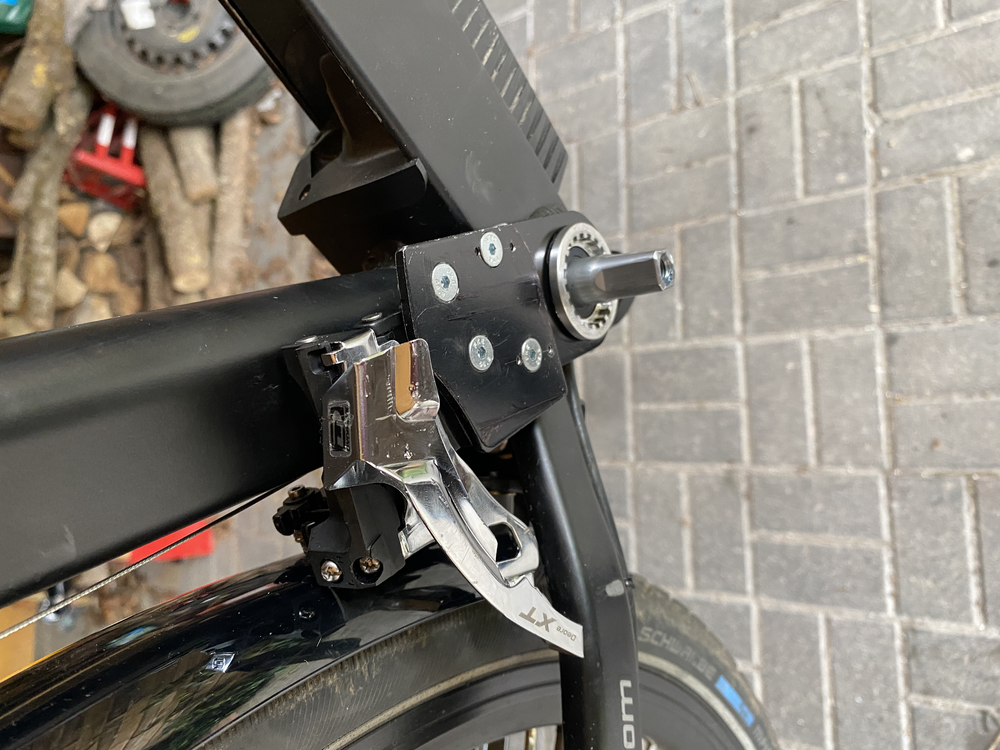

# NCM-BIKE-3x7-gears-Mod
How i modded my NCM Venice Bike, so it has now 3x7 gears.

Der Umbau wurde 2025 realisiert.
Als Umwerfer findet ein Shimano FD-M770-10 Verwendung.
Die Kettenblätter sind Shimano Acera oder ähnlich.  
Erklärvideo hier: 
https://www.youtube.com/shorts/eL2ofk0V0WU  
https://www.youtube.com/shorts/RujhcyvhY2o  
 
Für das Teil, dass am Kurbellager befestigt wird, gibt es im CAD-Ordner eine Schablone zur Herstellung.
(3D-Druck)

